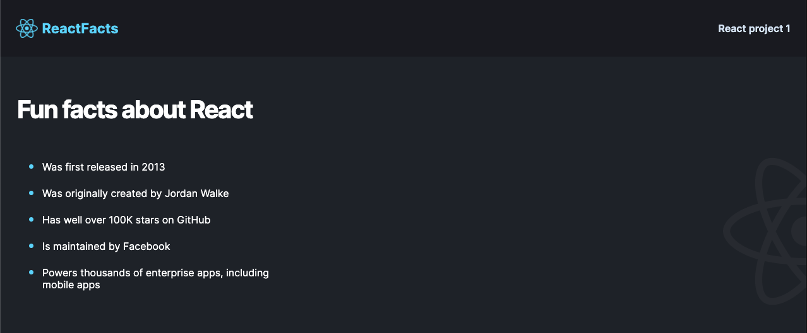

# reactFunFacts

Built this project to put the basics of React to practice.

**Link to project:** https://react-fun-facts-iota.vercel.app/

**Tech used:** HTML, CSS, JavaScript, React

## Lessons Learned:

- Why React is Useful - because it is composable and declarative; It's just javascript.
- Jsx
- Custom components
- Styling

## Examples:

Take a look at these couple examples that I have in my own portfolio:

**Personal Website:** https://github.com/VENGEAANCE/portfolio2023

**OpenAi Image Generator:** https://github.com/VENGEAANCE/OpenAi-Image-Generator
